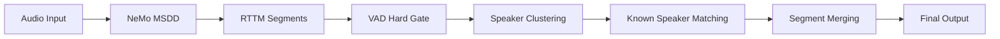

# vectorme

A command-line tool and HTTP server for speaker identification and diarization using ECAPA-TDNN, with built-in vector database.


Watch a video: https://youtu.be/-kvUzvcfD6o


## Features

- **Speaker Embeddings**: Extract 192-dimensional speaker embeddings
- **Speaker Database**: Store and query known speakers
- **Diarization**: Process audio in chunks to identify who is speaking when
- **NeMo MSDD TS-VAD**: Neural refinement with VAD hard-gating and intelligent segment merging
- **Configuration**: YAML-based configuration for all diarization parameters
- **HTTP Server**: REST API with streaming support
- **Web UI**: React-based voice recorder with Fast/Accurate mode selector
- **Format Support**: WAV, M4A, MP3, AAC, FLAC, OGG, and more (via ffmpeg)
- **GPU Acceleration**: CUDA and Metal (MPS) support

## Installation

```bash
cd vectorme
pip install -e .
```

Requires `ffmpeg` for audio format conversion:
```bash
# macOS
brew install ffmpeg

# Ubuntu/Debian
sudo apt install ffmpeg
```

## Download the model

```bash
vectorme --download-only
```

## Usage

### Basic Embedding Extraction

**Pipe audio from stdin:**
```bash
cat audio.wav | vectorme
```

**Read from file (supports wav, m4a, mp3, etc.):**
```bash
vectorme --file audio.m4a
```

### Vector Database

vectorme includes a built-in vector database for storing and querying speaker embeddings. The database is stored at `~/.vectorme/speakers.npz` by default.

**Add a speaker to the database:**
```bash
vectorme --file audio.wav --name "Doug"
# Added 'Doug' to database (1 total)
```

**Query for the closest match:**
```bash
vectorme --file unknown.wav
# {"matches": [{"name": "Doug", "similarity": 0.95}, ...], "best": {"name": "Doug", "similarity": 0.95}}
```

**List all speakers in the database:**
```bash
vectorme --list
# Doug
# Alice
# Bob
```

**Remove a speaker from the database:**
```bash
vectorme --remove "Doug"
# Removed 'Doug' from database
```

**Use a custom database location:**
```bash
vectorme --file audio.wav --db /path/to/custom.npz --name "Doug"
```

### Diarization

Process audio in chunks to identify speakers over time:

```bash
vectorme --file conversation.m4a --diarize
```

Output (NDJSON - one JSON object per line):
```json
{"event": "segment", "start": 0.0, "end": 1.0, "speaker": null, "vad_confidence": 0.82}
{"event": "segment", "start": 1.0, "end": 3.0, "speaker": "Doug", "vad_confidence": 0.91}
{"event": "segment", "start": 3.0, "end": 4.5, "speaker": null, "vad_confidence": 0.78}
{"event": "segment", "start": 4.5, "end": 8.0, "speaker": "Ayush", "vad_confidence": 0.85}
```

The `vad_confidence` field indicates the average speech probability for each segment (0.0-1.0). Higher values indicate higher confidence that the segment contains speech. This field is only included when VAD is enabled (default).

**Voice Activity Detection (VAD):**

VAD is enabled by default to filter out non-speech segments (silence, music, noise). This improves speaker identification accuracy by only processing chunks with detected speech.

```bash
# Default behavior - VAD enabled
vectorme --file audio.m4a --diarize

# Disable VAD
vectorme --file audio.m4a --diarize --no-vad

# Adjust VAD sensitivity (default: 0.5, range 0.0-1.0)
vectorme --file audio.m4a --diarize --vad-threshold 0.3
```

**Tuning parameters:**
```bash
vectorme --file audio.m4a --diarize \
  --chunk-size 3.0 \      # Chunk duration in seconds (default: 3.0, matches training)
  --chunk-hop 0.5 \       # Hop between chunks (default: 0.5)
  --threshold 0.5 \       # Minimum similarity to identify speaker (default: 0.5)
  --change-threshold 0.7 \# Threshold for speaker change detection (default: 0.7)
  --vad-threshold 0.5     # VAD speech probability threshold (default: 0.5)
```

### GPU Acceleration

Use `--gpu` to enable CUDA or Metal (MPS on Mac):

```bash
vectorme --file audio.m4a --gpu
# Using MPS acceleration
```

### Output Formats

When the database is empty, vectorme outputs the raw embedding:

**JSON (default):**
```bash
vectorme --file audio.wav --format json
# {"embedding": [0.123, -0.456, ...], "dimensions": 192}
```

**Space-separated list:**
```bash
vectorme --file audio.wav --format list
# 0.123 -0.456 0.789 ...
```

**NumPy binary:**
```bash
vectorme --file audio.wav --format numpy > embedding.npy
```

## HTTP Server

Run vectorme as an HTTP server for integration with other applications:

```bash
vectorme --serve
# Starting server on 127.0.0.1:3120
```

**Options:**
```bash
vectorme --serve --host 0.0.0.0 --port 8080 --gpu
```

### Web UI

The HTTP server includes a built-in React-based Web UI accessible at `http://localhost:3120/`.

**Features:**
- 🎙️ **Voice Recording**: Record audio directly in the browser
- ⚡ **Fast/Accurate Mode Selector**: Choose between streaming (Fast) or TS-VAD refined (Accurate) diarization
- 📊 **Real-time Visualization**: Color-coded speaker timeline with WaveSurfer.js
- 🏷️ **Speaker Management**: Name unknown speakers or reassign segments to existing speakers
- 💾 **Recording Storage**: Save/load recordings with automatic persistence
- 📈 **Similarity Scores**: View speaker match confidence and VAD metrics
- 🎨 **Interactive Timeline**: Click segments to play, hover for details

**Diarization Modes:**
- **⚡ Fast Mode** (default): Real-time streaming diarization during recording
- **🎯 Accurate Mode**: NeMo MSDD TS-VAD refinement with VAD hard-gating and segment merging

**Recording Workflow:**
1. Select **⚡ Fast** or **🎯 Accurate** mode (persisted in localStorage)
2. Click **Record** to start capturing audio
3. **Fast mode**: See real-time speaker segments during recording
4. **Accurate mode**: Processing runs after you stop recording
5. Click segments in the timeline to play from that point
6. Click unknown speakers to assign names from the database

### API Endpoints

#### Health Check
```bash
curl http://localhost:3120/health
# {"status": "ok", "speakers": 2}
```

#### List Speakers
```bash
curl http://localhost:3120/v1/speakers
# {"speakers": ["Ayush", "Doug"], "count": 2}
```

#### Add Speaker
```bash
curl -X POST http://localhost:3120/v1/speakers \
  -F "file=@voice_sample.m4a" \
  -F "name=Alice"
# {"message": "Added 'Alice' to database", "count": 3}
```

#### Remove Speaker
```bash
curl -X DELETE http://localhost:3120/v1/speakers/Alice
# {"message": "Removed 'Alice'", "count": 2}
```

#### Identify Speaker (single embedding)
```bash
curl -X POST http://localhost:3120/v1/audio/transcriptions \
  -F "file=@audio.m4a"
# {"matches": [{"name": "Doug", "similarity": 0.95}], "best": {"name": "Doug", "similarity": 0.95}}
```

#### Diarization (batch)
```bash
curl -X POST http://localhost:3120/v1/audio/transcriptions \
  -F "file=@conversation.m4a" \
  -F "response_format=diarized_json"
# {"duration": 59.07, "segments": [...], "speakers": ["Ayush", "Doug"]}
```

#### Diarization (streaming)
```bash
curl -N -X POST http://localhost:3120/v1/audio/transcriptions \
  -F "file=@conversation.m4a" \
  -F "response_format=diarized_json" \
  -F "stream=true"
```

Real-time NDJSON output:
```
{"event": "start", "duration": 59.07, "speakers": ["Ayush", "Doug"], "vad": true}
{"event": "speaker_change", "time": 0.0, "speaker": null, "similarity": 0.41, "vad_confidence": 0.85}
{"event": "segment", "start": 0.0, "end": 1.0, "speaker": null, "vad_confidence": 0.82}
{"event": "speaker_change", "time": 1.0, "speaker": "Doug", "similarity": 0.54, "vad_confidence": 0.91}
{"event": "segment", "start": 1.0, "end": 3.0, "speaker": "Doug", "vad_confidence": 0.88}
...
{"event": "done"}
```

**Event fields:**
- `segment.vad_confidence` - Average VAD speech probability for the segment (0.0-1.0, only when VAD enabled)
- `speaker_change.vad_confidence` - VAD confidence at the speaker change point (only when VAD enabled)

**Additional parameters:**
- `chunk_size` - Chunk duration in seconds (default: 3.0, matches ECAPA-TDNN training)
- `chunk_hop` - Hop between chunks (default: 0.5)
- `threshold` - Minimum similarity to identify speaker (default: 0.5)
- `change_threshold` - Speaker change detection threshold (default: 0.7)
- `filter_unknown=true` - Hide segments with unknown speakers
- `vad=false` - Disable Voice Activity Detection (enabled by default)
- `vad_threshold` - VAD speech probability threshold (default: 0.5)

## Configuration

VectorMe uses a YAML configuration file at `vectorme/config.yaml` for all diarization parameters:

```yaml
# TS-VAD refinement parameters
ts_vad:
  min_segment_duration: 0.3    # Filter segments shorter than 300ms
  min_cluster_audio: 1.2       # Minimum audio needed to identify a speaker
  max_concat_audio: 12.0       # Maximum audio to use for speaker embedding
  identify_threshold: 0.5      # Cosine similarity threshold for speaker matching

# VAD (Voice Activity Detection) parameters
vad:
  confidence_threshold: 0.5    # Speech probability threshold

# Speaker identification parameters
speaker:
  similarity_threshold: 0.3    # Threshold for matching known speakers
  change_threshold: 0.7        # Threshold for detecting speaker changes
```

These values are loaded at module initialization and used by both CLI and HTTP server.

## NeMo MSDD TS-VAD Refinement

VectorMe integrates NVIDIA NeMo's Multi-Scale Diarization Decoder (MSDD) for high-quality speaker diarization refinement with advanced post-processing:

1. **Streaming (Fast Mode)**: Real-time ECAPA-TDNN embeddings during recording
2. **TS-VAD Refinement (Accurate Mode)**: Neural refinement with VAD hard-gating and segment merging

### How It Works



**Pipeline Stages:**

1. **NeMo MSDD Diarization**: Multi-scale neural diarization produces RTTM segments with raw speaker labels

2. **VAD Hard Gate** (NEW): Filters silence/noise segments before speaker identification
   - Extracts waveform slice for each RTTM segment
   - Runs Silero VAD to compute `speech_ratio` and `avg_confidence`
   - Drops segments where `speech_ratio < 0.15` OR `avg_confidence < 0.25`
   - **Result**: Silence/noise segments never reach speaker matching → no `unknown_*` labels for non-speech

3. **Speaker Clustering**: Concatenates audio for each cluster, computes ECAPA-TDNN embeddings

4. **Known Speaker Matching**: Matches cluster embeddings against VectorDB using cosine similarity

5. **Segment Merging** (NEW): Intelligent post-processing to reduce fragmentation
   - Merges consecutive segments with **same speaker** if gap < 0.5s
   - Removes short unknown segments (<0.6s) sandwiched between segments with the **same known speaker**
   - **Result**: `Ayush / (0.3s pause) / Ayush` becomes single `Ayush` segment
   - **Preserves**: `Ayush / Amber / Ayush` stays as three separate segments

### NeMo Configuration

The NeMo MSDD model configuration is stored in `vectorme/nemo_msdd_configs/diar_infer_telephonic.yaml` and loaded automatically when using TS-VAD refinement. The configuration is optimized for telephonic/conversational audio with overlap detection disabled.

Key parameters are controlled via `vectorme/config.yaml` (see Configuration section above).

### API Usage

**Request TS-VAD refinement via API:**
```bash
curl -X POST http://localhost:3120/v1/audio/transcriptions \
  -F "file=@conversation.m4a" \
  -F "response_format=diarized_json" \
  -F "diarization_mode=ts_vad"
```

**Response includes:**
```json
{
  "mode": "ts_vad",
  "duration": 30.5,
  "segments": [
    {
      "start": 0.0,
      "end": 5.2,
      "speaker": "Doug",
      "similarity": 0.85,
      "cause": "ts_vad",
      "confidence": null
    },
    {
      "start": 5.2,
      "end": 12.8,
      "speaker": "unknown_1",
      "similarity": 0.72,
      "cause": "ts_vad",
      "confidence": null
    }
  ],
  "known_speakers": ["Doug"],
  "unknown_speakers": ["unknown_1"],
  "backend": "nemo_msdd"
}
```

### Web UI Integration

The Web UI provides two diarization modes:

- **⚡ Fast Mode**: Streaming diarization with real-time speaker detection during recording
- **🎯 Accurate Mode**: NeMo MSDD TS-VAD refinement runs after recording stops

Mode selection is persisted in browser localStorage. In Accurate mode:
1. Recording proceeds normally without real-time diarization
2. When you click **Stop**, the full audio is processed through NeMo MSDD pipeline
3. VAD hard-gating removes silence/noise segments
4. Speaker clustering and matching produces labeled segments
5. Segment merging reduces fragmentation from small gaps
6. Results replace any streaming segments

### Requirements

TS-VAD refinement requires additional dependencies:

```bash
pip install nemo_toolkit[asr]
```

The NeMo models are downloaded automatically on first use:
- `vad_marblenet` - Voice Activity Detection
- `ecapa_tdnn` - Speaker embeddings (NeMo variant)
- `diar_msdd_telephonic` - Multi-Scale Diarization Decoder

## About ECAPA-TDNN

ECAPA-TDNN produces 192-dimensional speaker embeddings that can be used for:
- Speaker verification (is this the same person?)
- Speaker identification (who is speaking?)
- Speaker clustering (group audio by speaker)

The model is trained on VoxCeleb dataset and downloaded from SpeechBrain's model hub.

### Training Segment Size

The pretrained `speechbrain/spkrec-ecapa-voxceleb` model was trained on **fixed-length 3.0 second audio crops** at 16kHz (48,000 samples). This has important implications:

- **Chunk size**: We default to 3.0s chunks to match training conditions
- **Shorter segments**: Segments much shorter than 3s produce noisier, less stable embeddings
- **Longer segments**: The model supports variable-length input via attentive statistical pooling, but if multiple speakers are present in one segment, the embedding will be a "blend" of all speakers
- **Best practice for enrollment**: Use 3-10 seconds of single-speaker audio when adding speakers to the database

References:
- [SpeechBrain ECAPA recipe](https://github.com/speechbrain/speechbrain/blob/develop/recipes/VoxCeleb/SpeakerRec/hparams/train_ecapa_tdnn.yaml)
- [Model card](https://huggingface.co/speechbrain/spkrec-ecapa-voxceleb)
